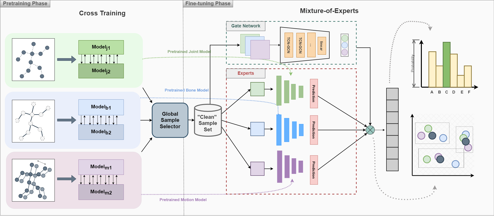

# Skeleton-Based Human Action Recognition with Noisy Labels

Yi Xu, Kunyu Peng, Di Wen, Ruiping Liu, Junwei Zheng, Yufan Chen, Jiaming Zhang, Alina Roitberg, Kailun Yang, Rainer Stiefelhagen

  

    Our Paper `:last_quarter_moon_with_face:` :  <a href="https://arxiv.org/abs/2403.09975">Paper</a>
  

 
## Content

- [Abstract](#Abstract)
- [Code Structure](#Structure)
- [Methodology](#Methodology)
- [Framework](#Framework)

### Abstract

Understanding human actions from body poses is critical for assistive robots sharing space with humans in order to make informed and safe decisions about the next interaction. However, precise temporal localization and annotation of activity sequences is time-consuming and the resulting labels are often noisy. If not effectively addressed, label noise negatively affects the model’s training, resulting in lower recognition quality. Despite its importance, addressing label noise for skeleton-based action recognition has been overlooked so far. In this study, we bridge this gap by implementing a framework that augments well-established skeleton-based human action recognition methods with label-denoising strategies from various research areas to serve as the initial benchmark. Observations reveal that these baselines yield only marginal performance when dealing with sparse skeleton data. Consequently, we introduce a novel methodology, NoiseEraSAR, which integrates global sample selection, co-teaching, and Cross-Modal Mixture-of-Experts (CM-MOE) strategies, aimed at mitigating the adverse impacts of label noise. Our proposed approach demonstrates better performance on the established benchmark, setting new state-of-the-art standards. 

### Structure
- [ ] TODO.

### Methodology 

  

### Framework

- [ ] TODO.

